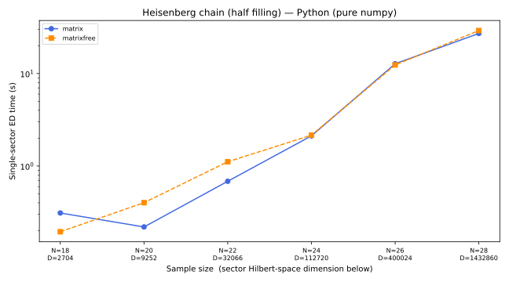
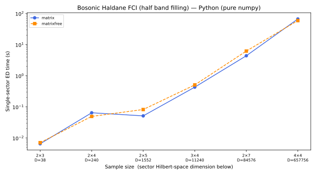
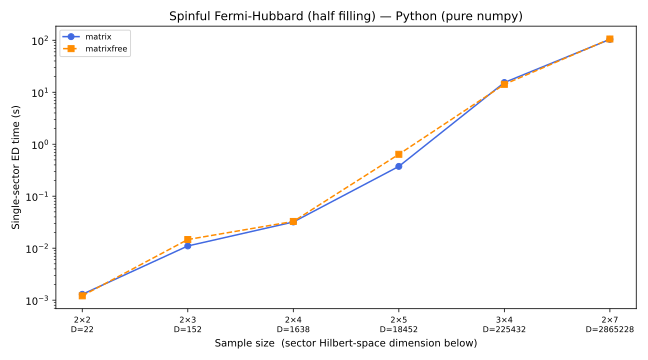
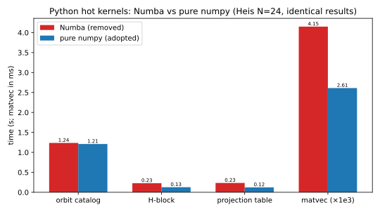

# Package `realspace_exactdiagonalization_py`

Symmetry-resolved exact diagonalization on _arbitrary_ real-space graphs,
**supporting both spin/bosonic and fermionic systems with arbitrary spins
or other internal degrees of freedom** — the Python port of
[`RealSpace_ExactDiagonalization.jl`](https://github.com/GrothendieckUniverse/RealSpace_ExactDiagonalization).

A high-performance, statistics-agnostic implementation in the design
philosophy of [XDiag](https://github.com/awietek/xdiag).  The package
block-diagonalizes interacting quantum lattice Hamiltonians via bitmask
encoding, orbit–stabilizer decomposition, and irrep-induced projection,
with or without forming the full many-body matrix.  The energy output is
verified against the Julia reference to **< 2×10⁻¹³** on the FCI test
cases (see [Energy Alignment](#energy-alignment)).

---

## Table of Contents

- [Design Innovations](#design-innovations)
- [Architecture](#architecture)
- [Theoretical Background](#theoretical-background)
- [⚠️ Understanding `filling_fraction`](#️-understanding-filling_fraction)
- [Quick Start](#quick-start)
- [Examples](#examples)
- [Many-Body Topological Observables](#many-body-topological-observables)
- [Energy Alignment](#energy-alignment)
- [Benchmarks](#benchmarks)
- [Implementation Differences from the Julia Engine](#implementation-differences-from-the-julia-engine)
- [Tests](#tests)
- [File Structure](#file-structure)
- [Dependencies](#dependencies)
- [References](#references)

---

## Design Innovations

1. **Bitmask encoding** — every Fock configuration $|n_1,\ldots,n_N\rangle$
   (hard-core, $n_i\in\{0,1\}$) is a single integer
   $m = \sum_i n_i 2^{i-1}$, enabling $O(1)$ bitwise operations
   (popcount, count-trailing-zeros, AND/OR/XOR), plus the **combinadic
   rank** $\sum_j \binom{b_j}{j+1}$ (XDiag's `rank_combination`) giving a
   hash-free bijection between bitmasks and $[0, C(N,N_e))$.

2. **Orbit–stabilizer decomposition** — the many-body Hilbert space is
   partitioned into orbits under the symmetry group $G$.  Each orbit is
   labelled by a canonical representative $|[\mathbf{s}]\rangle$ and its
   stabilizer subgroup data.  Only representatives are stored, achieving
   the optimal $|G|$-fold compression.

3. **Irrep-induced projection** — 1-D irreducible representations of
   finite abelian groups supply projectors $P_\chi$ that
   block-diagonalize the Hamiltonian without ever constructing the full
   matrix.  An orbit contributes to irrep $\chi$ iff its stabilizer
   phases satisfy a compatibility condition.

4. **Two computational modes, one representative table** — a *matrix
   mode* that precomputes sparse CSR matrices for fast ARPACK
   diagonalization (memory-intensive but fast), and a *matrix-free mode*
   that computes $H|\psi\rangle$ from a precomputed projection table
   (row–column–amplitude triplets, kept in CSR form for a single sparse
   matvec per call).  Both modes obtain O(1) canonical-
   representative lookups from the **XDiag-style representative tables**
   (dense `(rep, g, α)` arrays over the full basis, indexed by the
   combinadic rank — no hashing, ~16 B/state instead of the ~64 B/state
   of a Dict).

5. **Unified boson/fermion treatment** — the entire pipeline is
   statistics-agnostic.  Fermionic signs (permutation parity in symmetry
   actions and Jordan–Wigner strings in hopping) are injected via the
   `Particle_Statistics` enum with zero runtime branching overhead inside
   the compiled kernels.

6. **Twisted boundary conditions & spectral flow** —
   `update_second_quantized_model_with_twisted_phases` applies the
   Peierls substitution via `TightBinding.generate_bilinear_terms`.  For
   flux scans the orbit catalog is built once and its stabilizer phases
   are updated in-place via `update_orbit_stabilizer_phases` — avoiding
   the expensive Gosper iteration at every flux point.  The flux-aware
   translation group preserves ordinary momentum labels.

## Architecture

The data flow is identical to the Julia engine (see its README for the
diagram):

1. **Define model** — construct the lattice (via `tightbinding_py`), add
   hopping and interaction terms with particle statistics.
2. **Build symmetry group** — generate `Symmetry_Operation`s
   (permutations + U(1) phases) and their 1-D irreps.
3. **Enumerate configurations** — Gosper's hack iterates all bitmasks at
   fixed particle number in lexicographic order.
4. **Orbit–stabilizer decomposition** — partition bitmasks into
   $G$-orbits; record canonical representatives and stabilizer phases.
5. **Filter by irrep** — keep only orbits satisfying
   $\chi(h) = \alpha_h([\mathbf{s}])$ for all $h\in\mathrm{Stab}$.
6. **Build Hamiltonian block** — sparse CSR matrix (matrix mode,
   accelerated by `CanonicalMap`) or pre-populate `CanonicalMap` and run
   matrix-free Lanczos.
7. **Diagonalize** — scipy ARPACK (both modes) to obtain eigenvalues and
   eigenvectors.
8. **Post-process** — analyse spectra, compute correlators, checkpoint
   and resume.

### Parallelism

| Task | Julia | Python |
|---|---|---|
| `H\|\psi\rangle` (matrix-free) | `Threads.@threads` over a precomputed projection table | one `scipy.sparse` matvec (CSR form of the projection table) |
| H-block construction | `Threads.@threads` | vectorized numpy (per-term gather/scatter) |
| Sparse diagonalization | Arpack.jl (+BLAS threads) | scipy ARPACK (`eigs`, OpenBLAS) |
| Distributed memory | none (multithreading only, like Python) | none (pure-numpy, shared-memory only) |

## Theoretical Background

### Bitmask Encoding

$$\boxed{|\mathbf{s}\rangle \equiv |n_1,\ldots,n_N\rangle
    \;\longmapsto\; m = \sum_{i=1}^N n_i\,2^{\,i-1}
    \;\in\; \{0,1,\ldots,2^N-1\}.}$$

Bit $i-1$ (0-based) corresponds to vertex $i$ (1-based).  For $N \le 63$
the masks fit in 64 bits and the hot loops run on `numpy.uint64` arrays.

### Symmetry Action

For a finite system it is meaningless to speak of spontaneous symmetry
breaking — symmetry is the property $[H, U_g] = 0$ for a unitary
representation of a finite group $G$.  The action on creation operators
defines the representation:

$$\boxed{U_g\,a_i^\dagger\,U_g^{-1} = \eta_g(i)\,a_{\pi_g(i)}^\dagger,}$$

with $\pi_g \in S_N$ a permutation and $\eta_g(i)$ a U(1) phase.  On a
Fock mask,

$$U_g |n_1,\ldots,n_N\rangle =
    \Big(\prod_{i\in\mathrm{occ}} \eta_g(i)\Big)\,\mathrm{sgn}_g(\mathrm{occ})\,
    |n_{\pi(1)},\ldots,n_{\pi(N)}\rangle,$$

where $\mathrm{sgn}_g = 1$ for bosons and the permutation parity for
fermions (tracked via `popcount(new_mask >> π(i))`).

### Orbit–Stabilizer Theorem

For each orbit $\mathcal{O}_{[\mathbf{s}]}$ with canonical representative
$[\mathbf{s}]$ (the smallest mask in the orbit), the projector onto the
orbit's irrep-compatible subspace is

$$P_\chi[\mathbf{s}] \propto
    \sum_{g \in G} \chi(g)^*\, U_g |[\mathbf{s}]\rangle
    \propto \sum_{h \in \mathrm{Stab}([\mathbf{s}])}
    \chi(h)^*\, \alpha_h([\mathbf{s}]) |[\mathbf{s}]\rangle .$$

An orbit contributes to irrep $\chi$ iff
$\chi(h) = \alpha_h([\mathbf{s}])$ for all $h \in \mathrm{Stab}$, and the
normalized basis state carries the factor $\sqrt{|G|/|\mathrm{Stab}|}$.

### Hamiltonian Matrix Elements

For $H = \sum t_{ij} a_i^\dagger a_j + \sum V_{ij} n_i n_j$,

$$H_{\mathrm{row},\mathrm{col}} = t_{ij}\,
    \underbrace{(-1)^{n_{\mathrm{between}}}}_{\text{JW string}}\,
    \underbrace{\alpha\,\chi(g)^*}_{\text{projection}}\,
    \sqrt{\frac{|\mathrm{Stab}(\mathrm{row})|}{|\mathrm{Stab}(\mathrm{col})|}},$$

with $\alpha$ the phase accumulated when the hopping image of the column
representative is mapped back to the row representative by group element
$g$.

### Jordan–Wigner String (Fermions)

Hopping $i_{\mathrm{from}} \to i_{\mathrm{to}}$ acquires
$(-1)^{\{\text{\# occupied sites strictly between}\}}$, so fermions differ
from hard-core bosons only by local sign factors — no explicit
Jordan–Wigner transform is needed.

## ⚠️ Understanding `filling_fraction`

A crucial, frequently-misunderstood point: the `filling_fraction` argument
of `build_ed_data` is defined as **particles per _flattened_ graph
vertex**:

$$\text{filling\_fraction} = \frac{N_{\text{particles}}}{N_{\text{total\_graph\_vertices}}}$$

This is **NOT** the same as the "filling per band" or "filling per site"
used in many physics communities, because the ED graph flattens ALL
internal degrees of freedom (spin, sublattice, valley, band) into
individual vertices.

| Model | Community filling | Vertex filling | `filling_fraction` |
|---|---|---|---|
| Spinful Hubbard, 1 e/site | half filling | 1/2 | `Fraction(1, 2)` |
| Haldane honeycomb, ν = 1/2 per band | 1/2 per band | 1/4 | `Fraction(1, 4)` |
| Checkerboard, ν = 1/3 per band | 1/3 per band | 1/6 | `Fraction(1, 6)` |

`filling_fraction` is an exact `fractions.Fraction`; `n_filled =
filling_fraction * n_site` is asserted to be an integer.

## Quick Start

```python
from fractions import Fraction
import realspace_exactdiagonalization_py as ed

# ── Build the Haldane honeycomb model (2×3 unit cells, 3 hard-core bosons) ──
model = ed.build_zero_flux_bosonic_fci_second_quantized_model(
    sample_size=[2, 3], params=ed.params_DNSheng)

# ── Translation symmetry: |G| = 6 ──
symmetry_group = ed.build_translation_group(model.lattice)

# ── Build ED data: 3 bosons / 12 graph vertices = filling_fraction 1/4 ──
#    (⚠️ NOT ν=1/2 per band — that would be 6 bosons!)
ed_data = ed.build_ed_data(model, filling_fraction=Fraction(3, 12),
                           symmetry_group=symmetry_group)

# ── Scan all momentum sectors (matrix mode) ──
ed.ed_scan(ed_data, nev=5, mode="matrix")

# ── Inspect ──
ed.print_spectrum(ed_data, shift_to_zero=True)
fig, ax = ed.plot_spectrum(ed_data, shift_to_zero=True)
# → E0 ≈ -7.163805 at k=(0,0), E1 ≈ -7.163375 at k=(1,0)
#   the two nearly-degenerate bosonic semion FCI states (GSD = 2)
```

### Checkpoint-Resume

```python
ed.ed_scan(ed_data, nev=5, mode="matrix",
           checkpoint_path="checkpoints/my_scan.pkl")   # survives a crash
ed.ed_scan(ed_data, nev=5, mode="matrix",
           checkpoint_path="checkpoints/my_scan.pkl")   # resume: computed sectors skipped
```

## Examples

### 1. Spin-½ Heisenberg Chain — `examples/spin_heisenberg_chain.py`

$H = J\sum_{\langle i,j\rangle}\mathbf{S}_i\cdot\mathbf{S}_j$ via the
Matsubara–Matsuda hard-core boson mapping, half filling (total
$S^z = 0$), $\mathbb{Z}_{N_{\mathrm{site}}}$ translation symmetry.
Ground-state energy matches the Bethe ansatz $E_0/N = \tfrac14 - \ln 2$.

### 2. Bosonic Fractional Chern Insulator — `examples/boson_fci_haldane.py`

The extended Bose–Hubbard model on the Haldane honeycomb lattice at
$t'' = -0.58$ (D. N. Sheng *et al.*, PRL **107**, 146803 (2011)): two
nearly-degenerate ground states at $k=(0,0)$ and $k=(1,0)$ on $[2,3]$ —
the semion FCI doublet.

### 3. Spinful Fermi-Hubbard Model — `examples/fermion_hubbard_square.py`

Spin degrees of freedom flattened into an interleaved graph
(i↑ → 2i−1, i↓ → 2i); half filling per spin; $\mathbb{Z}_{L_x}\times
\mathbb{Z}_{L_y}$ translation symmetry.

### 4. Fermionic Fractional Chern Insulator — `examples/fermion_fci_checkerboard.py`

The checkerboard lattice with staggered flux (Sun–Gu–Katsura–Sarma,
arXiv:1012.5864): two flat Chern bands, three nearly-degenerate
ground states at $\nu = 2/3$ per band (GSD = 3).

## Many-Body Topological Observables

- **Spectrum flow** — `ed.flux_spectrum_flow(model, sector_labels, ...)`
  threads flux $\theta$ through one periodic direction and tracks
  $E(\theta)$ per momentum sector.
- **Fractional charge pump** — `ed.flux_charge_pump(...)` projects
  Resta's periodic position operator into the low-energy manifold and
  unwraps the polarization branches; the pumped charge equals the
  many-body Hall conductance (Laughlin–Thouless pump).
- **Static structure factor** — `static_structure_factor`,
  `compute_structure_factor_map` (connected $S(q)$; Bragg peaks → charge
  order).
- **Off-diagonal long-range order** — `off_diagonal_long_range_order`,
  `compute_odlro_map` (condensate fraction diagnostic).
- **Entanglement spectrum** — `entanglement_spectrum`,
  `particle_entanglement_spectrum`.
- **Many-body Chern number** — `many_body_chern_number` (Fukui–Hatsugai–
  Suzuki on the flux torus).
- **Density distribution** — `vertices_occupation_distribution_full_ed`.

Documentation: `doc/charge_pump.ipynb`, `doc/observables.ipynb`.

## Energy Alignment

The port is verified against the Julia reference (system Julia 1.12.7,
ARPACK, `nev=5`, matrix mode) on this machine:

| Test case | Geometry | Filling | Julia $E_0$ | Python $E_0$ | max $\|\Delta E\|$ |
|---|---|---|---|---|---|
| Bose–Hubbard, Haldane honeycomb FCI ($t'' = -0.58$) | [3,4]×2 | ½ per band (6 bosons) | −14.301456146831018 (k=(0,0)) | −14.301456146831026 | 1.7×10⁻¹³ |
| Fermi–Hubbard, checkerboard FCI ($t'' = -0.2$) | [3,4]×2 | ⅓ per band (4 fermions) | −6.832285968463585 (k=(0,2)) | −6.832285968463586 | 5.4×10⁻¹⁴ |

The residual differences are ARPACK convergence noise, five orders of
magnitude below the 1e-8 validation tolerance.  The full sector-by-sector
comparison lives in `test/test_energy_alignment.py` (runnable with
`uv run python -m unittest test.test_energy_alignment`).

## Benchmarks

`benchmark/benchmark.py` reproduces the single-sector benchmark of the
Julia repository (Heisenberg chain, bosonic Haldane FCI, spinful
Fermi-Hubbard; matrix + matrix-free modes; CSV output and scaling
plots; a combined Python-vs-Julia comparison figure):

```bash
uv run python benchmark/benchmark.py            # full suite
uv run python benchmark/benchmark.py --scan    # multi-size scan (all geometries)
uv run python benchmark/benchmark.py --small   # fast sanity subset
```

The Julia reference timings (same machine, `julia -t 10`) are in
`../RealSpace_ExactDiagonalization/benchmark/benchmark_data/benchmark_raw.csv`;
Python results land in `benchmark/benchmark_data/benchmark_raw_py.csv`
(single sizes) / `benchmark_raw_py_scan.csv` (scan).
See `doc/benchmark.ipynb` for the analysis and the comparison figures
(`benchmark/figures_py/benchmark_scan_new_vs_previous.svg`,
`benchmark_scan_new_py_vs_julia.svg`).  The README figures below are
regenerated with `uv run python benchmark/make_readme_figures.py` (reads the
Julia + Python scan CSVs and the recorded A/B measurements).  Both languages
are multithreading-only and cover the same system sizes: Heisenberg
$N=18\ldots28$, Haldane $[2,3]\ldots[4,4]$, Hubbard $[2,2]\ldots[2,7]$.

### Single-sector ED time vs sample size (sector Hilbert dimension under each tick)

Each point is the single-sector ED wall time (sector index 0, `nev=1`),
mean of two reps after JIT warmup.  The x-axis ticks are labelled with the
sample size and, underneath, the sector Hilbert-space dimension $D$.  Both
the **matrix** and **matrix-free** modes are shown.







### Python: why Numba was removed (A/B, Heis $N=24$, bit-identical results)

A controlled A/B on the same inputs showed that chunked pure-numpy
vectorization **beats** the former Numba `njit`/`prange` layer on every hot
path (see `doc/design.ipynb` for the vectorization techniques):



| Kernel | Numba (removed) | Pure numpy (adopted) | ratio |
|---|---|---|---|
| Orbit-catalog build | 1.25 s | 1.22 s | 0.97× |
| H-block construction | 0.23 s | 0.13 s | **0.56×** |
| Projection table | 0.23 s | 0.12 s | **0.53×** |
| One matvec | 4.15 ms | 2.61 ms (CSR) | **0.63×** |

Removing Numba also removes the JIT warmup cost and the
`NUMBA_NUM_THREADS` configuration surface: the runtime stack is numpy +
scipy only.

## Implementation Differences from the Julia Engine

Functional fidelity is strict (identical algorithms, formulas, and
conventions — 1-based site indices, identical group/irrep structures, and
the verified energy output), while the implementation uses the natural
Python tooling.  All differences and their reasons are documented in
`doc/design.ipynb`; the main ones:

- **pure-numpy vectorized kernels** (since v0.1.x; the earlier Numba
  `njit`/`prange` layer was removed after a controlled A/B — with chunked
  vectorization (byte-lookup group actions, two-pass rep test, CSR
  matvec) pure numpy **beats** numba on every hot path: catalog 0.97×,
  H-block 0.56×, projection table 0.53×, matvec 0.63× of the numba
  time, all bit-identical).  Julia keeps its native `@inbounds
  @fastmath` / `Threads.@threads` loops;
- **scipy.sparse CSR + `eigs`** replaces `SparseMatrixCSC` + Arpack.jl
  (both are ARPACK underneath);
- **`scipy.sparse.linalg.LinearOperator` + `eigs`** replaces KrylovKit
  `eigsolve(:SR)` for the matrix-free mode;
- **diagonalization convention (shared)**: the Julia reference runs
  LAPACK ``zheev`` on the **upper triangle of the raw block**
  (``eigen(Hermitian(Matrix(H)))``) for ``n ≤ 500`` and a **general
  (non-Hermitian) smallest-real-part ARPACK solve** on the raw block /
  raw matrix-free operator (``:SR``) for larger sectors.  For flux-aware
  groups the projected block can be non-Hermitian in this gauge (complex
  self-loop diagonals).  The Python port reproduces these semantics
  exactly (``np.linalg.eigh(UPLO="U")``, ``scipy.sparse.linalg.eigs
  (which="SR")``) — verified to 1e-12 across a 7×7 flux grid;
- **representative tables** (both languages, after the XDiag study):
  the canonicalization cache is a set of dense per-state arrays over the
  full fixed-filling basis (representative index, group element,
  amplitude — Combinadic-rank-indexed), replacing `Dict`/`Set` caches;
  the matrix-free mode additionally precomputes the ``(row, column,
  amplitude)`` projection table once per sector, kept in CSR form so
  each ``H·x`` is a single sparse matvec (18× faster matvecs on the
  Haldane [2,7] sector);
- **pickle** replaces JLD2 for checkpoints (extension `.pkl`);
- **`enum.Enum`** replaces MLStyle `@data` singletons
  (`Particle_Statistics.BOSONIC/FERMIONIC`);
- **parallelism is multithreading-only in both languages** (an earlier
  Julia `Distributed.pmap` layer was removed: on a workstation it
  re-serialized the ~100 MB-scale representative tables to every worker on
  every sector, blowing up per-process memory at large sizes — e.g. Heis
  N=28; the pure `Threads.@threads` / vectorized-numpy shared-memory paths
  are faster *and* memory-bounded); Python is **pure numpy, shared-memory
  only** — no distributed code, no Numba;
- Python `int` masks (arbitrary precision) with `uint64` arrays for
  $N \le 63$.

The TightBinding side of the port is documented in
`../TightBinding_PY/doc/design.md`.

## XDiag study — adopted and deferred tricks

From the XDiag deep-dive (arXiv:2505.02901; https://github.com/awietek/xdiag), the
following tricks were **adopted in both Julia and Python**: combinadic-rank
representative tables (no hashing), the **LinTable split-table O(1) rank**
(Lin 1990; used for n ≤ 42, O(k) rank fallback otherwise), the matrix-free
projection table (gather–scatter matvec), and branch-free XOR hopping with a
direction-aware mask gate.
**Evaluated but not adopted** (with reasons):

- *bit-packed per-state arrays* — the plain `Int32`/`ComplexF32` tables are
  already ~4–10× smaller than the old `Dict`/`Set` caches; bit-packing would
  save more memory at the cost of unaligned reads (future work for very large
  systems);
- *parallel two-phase COO build* — the Julia H-block construction is already
  fast with `Threads.@threads` (an earlier `Distributed.pmap` layer was removed);
- *NonBranchingOp local-op tables* — all current models are two-site terms
  already covered by the branch-free hop kernels;
- *Simon selective reorthogonalization / LOBPCG* — KrylovKit / ARPACK already
  cover the needed Lanczos behaviour.

## Tests

```bash
uv run python -m unittest discover test -v
```

- `test/test_core.py` — bitwise operations, symmetry actions, model
  building, small-ED regression values.
- `test/test_energy_alignment.py` — the two FCI test cases against the
  embedded Julia reference energies.

## File Structure

```
RealSpace_ExactDiagonalization_PY/
├── pyproject.toml                       # uv project (path-dep on tightbinding-py)
├── README.md
├── src/realspace_exactdiagonalization_py/
│   ├── __init__.py                      # top-level API (mirrors the Julia exports)
│   ├── bitwise_operations.py            # mask encode/decode/occupy/empty/iter
│   ├── second_quantized_model.py        # Real_Space_Second_Quantized_Model
│   ├── symmetry_resolved_ed.py          # the ED engine (pure-numpy kernels)
│   ├── models/                          # bosonic_fci, fermionic_fci, heisenberg, hubbard
│   └── observables/                     # spectrum_flow, charge_pump, + more
├── examples/                            # 4 examples (ports of the Julia examples)
├── doc/                                 # design, FCI, observables, charge-pump, benchmark notebooks
├── test/                                # unit + energy-alignment regression tests
├── benchmark/                           # benchmark.py + CSV/figures
└── figures/                             # example/notebook figures
```

## Dependencies

Managed with `uv` (`uv sync`); the runtime stack is **pure numpy** and
scipy (no Numba — the port is fully vectorized numpy), matplotlib, and
`tightbinding-py` (the `TightBinding_PY` port, declared as an editable
path dependency).  Jupyter (`ipykernel`, `nbformat`) for the notebooks.

## References

1. **XDiag** — A. Wietek et al., arXiv:2505.02901;
   https://github.com/awietek/xdiag
2. **Bosonic FCI model** — D. N. Sheng, Z.-C. Gu, K. Sun, L. Sheng,
   *Fractional Chern insulator on the honeycomb lattice with bosons*,
   Phys. Rev. Lett. **107**, 146803 (2011).
3. **Fermionic checkerboard FCI** — K. Sun, Z. Gu, H. Katsura, S. Das
   Sarma, *Nearly flatbands with nontrivial topology*, Phys. Rev. Lett.
   **106**, 236803 (2011).
4. **Haldane model** — F. D. M. Haldane, *Model for a quantum Hall effect
   without Landau levels*, Phys. Rev. Lett. **61**, 2015 (1988).
5. **Chern number discretization** — T. Fukui, Y. Hatsugai, H. Suzuki,
   J. Phys. Soc. Jpn. **74**, 1674 (2005).
6. **Many-body polarization** — R. Resta, *Quantum-mechanical position
   operator in extended systems*, Phys. Rev. Lett. **80**, 1800 (1998);
   R. B. Laughlin, *Quantized Hall conductivity in two dimensions*,
   Phys. Rev. B **23**, 5632 (1981).
